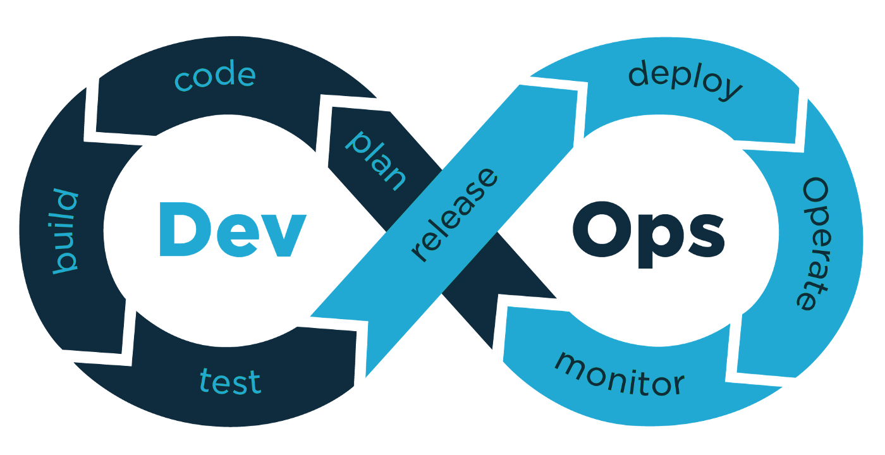

# DevOps-Projects

This repository contains my DevOps projects

>Every branch of this repo contains each DevOps project.

<table>
<tr>
<th>No.</th>
<th>Project</th>
<th>Technologies Used</th>
<th>Description</th>
<th>Youtube Video</th>
</tr>
<tr>
<td>1</td>
<td>
<a href="https://github.com/tush-tr/DevOps-Projects/tree/Complete-CI/CD-with-Terraform-AWS">
Complete CI/CD with Terraform and AWS
</a>
</td>
<td>Terraform, Github Actions, Docker, AWS</td>
<td>Deploying example app to aws ec2 using docker, github actions, terraform, AWS ECR</td>
<td>
<a href="https://www.youtube.com/watch?v=5sZAx2ylsOo&t=520s">Checkout video</a>
</td>
</tr>
</table>

